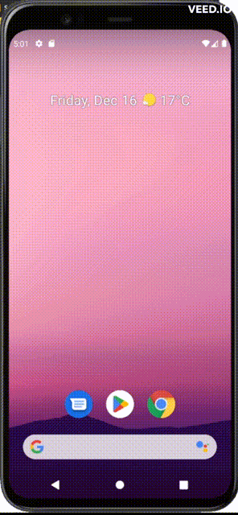

# **URL-Connection**

<details>

**<summary>Application Images</summary>**



</details>

### **Code**

<ul>

#### <li>**Java files**

<ul>

<li>

<details>

**<summary>`MainActivity.java`</summary>**

```java
package com.example.urlconnection;

import androidx.appcompat.app.AppCompatActivity;

import android.content.Context;
import android.net.ConnectivityManager;
import android.net.NetworkInfo;
import android.os.AsyncTask;
import android.os.Bundle;
import android.util.Log;
import android.widget.Button;
import android.widget.EditText;
import android.widget.TextView;
import android.widget.Toast;

import java.io.IOException;
import java.io.InputStream;
import java.io.InputStreamReader;
import java.io.Reader;
import java.io.UnsupportedEncodingException;
import java.net.HttpURLConnection;
import java.net.URL;

public class MainActivity extends AppCompatActivity {

    private Button buttonDownload;
    private EditText urlText;
    private TextView textView;


    @Override
    protected void onCreate(Bundle savedInstanceState) {
        super.onCreate(savedInstanceState);
        setContentView(R.layout.activity_main);

        this.buttonDownload = findViewById(R.id.buttonDownload);
        urlText = findViewById(R.id.urlText);
        textView = findViewById(R.id.textView);

        this.buttonDownload.setOnClickListener(view -> {

            String stringUrl = urlText.getText().toString();
            ConnectivityManager connMgr = (ConnectivityManager) getSystemService(Context.CONNECTIVITY_SERVICE);

            NetworkInfo networkInfo = connMgr.getActiveNetworkInfo();

            if (networkInfo != null && networkInfo.isConnected()) {

                new DownloadWebpageText().execute(stringUrl);

            } else {
                textView.setText("No network connection available.");
            }


        });


    }

    private class DownloadWebpageText extends AsyncTask<Object, Object, String> {

        @Override
        protected String doInBackground(Object[] urls) {

            try {
                return downloadUrl((String) urls[0]);
            } catch (IOException e) {
                return "Unable to retrieve web page. URL may be invalid.";
            }
        }

        @Override
        protected void onPostExecute(String result) {

            int i = result.indexOf("<p>");

            i += 3;
            String words = "";
            boolean finish = false;
            while (!finish) {
                if (result.substring(i, i + 4).equals("</p>")) {
                    finish = true;
                } else {
                    words += result.charAt(i);
                    i++;
                }
            }

            textView.setText(words);
        }


    }

    public String downloadUrl(String myurl) throws IOException {
        InputStream is = null;
        int len = 10000;

        try {
            URL url = new URL(myurl);
            HttpURLConnection conn = (HttpURLConnection) url.openConnection();
            conn.setReadTimeout(10000 /* milliseconds */);
            conn.setConnectTimeout(15000 /* milliseconds */);
            conn.setRequestMethod("GET");
            conn.setDoInput(true);
            // Starts the query
            conn.connect();
            int response = conn.getResponseCode();
            Log.d("HttpExample", "The response is: " + response);
            is = conn.getInputStream();

            String contentAsString = readIt(is, len);


            return contentAsString;

        } finally {
            if (is != null) {
                is.close();
            }
        }
    }

    public String readIt(InputStream stream, int len) throws IOException, UnsupportedEncodingException {
        Reader reader = null;
        reader = new InputStreamReader(stream, "UTF-8");
        char[] buffer = new char[len];
        reader.read(buffer);

        return new String(buffer);
    }


    public Button getButtonDownload() {
        return buttonDownload;
    }

    public void setButtonDownload(Button buttonDownload) {
        this.buttonDownload = buttonDownload;
    }

    public EditText getUrlText() {
        return urlText;
    }

    public void setUrlText(EditText urlText) {
        this.urlText = urlText;
    }

    public TextView getTextView() {
        return textView;
    }

    public void setTextView(TextView textView) {
        this.textView = textView;
    }
}


```

</details>

</li>

</ul>

</li>

### <li>**XML files**

<ul>

<li>

<details>

**<summary>`activity_main.xml`</summary>**

```xml
<?xml version="1.0" encoding="utf-8"?>
<LinearLayout xmlns:android="http://schemas.android.com/apk/res/android"
    xmlns:app="http://schemas.android.com/apk/res-auto"
    xmlns:tools="http://schemas.android.com/tools"
    android:layout_width="match_parent"
    android:layout_height="match_parent"
    android:orientation="vertical"
    android:padding="10dp"
    tools:context=".MainActivity">

    <LinearLayout
        android:layout_width="match_parent"
        android:layout_height="wrap_content"
        android:orientation="horizontal">

        <TextView
            android:layout_width="wrap_content"
            android:layout_height="wrap_content"
            android:text="URL to download:"
            app:layout_constraintBottom_toBottomOf="parent"
            app:layout_constraintEnd_toEndOf="parent"
            app:layout_constraintStart_toStartOf="parent"
            app:layout_constraintTop_toTopOf="parent" />

        <EditText
            android:id="@+id/urlText"
            android:layout_width="match_parent"
            android:layout_height="wrap_content" />
    </LinearLayout>

    <Button
        android:id="@+id/buttonDownload"
        android:layout_width="wrap_content"
        android:layout_height="wrap_content"
        android:text="DOWNLOAD" />


    <TextView
        android:id="@+id/textView"
        android:layout_width="wrap_content"
        android:layout_height="wrap_content" />
</LinearLayout>
```

</details>

</li>

<li>

<details>

**<summary>`AndroidManifest.xml`</summary>**

```xml
<?xml version="1.0" encoding="utf-8"?>
<manifest xmlns:android="http://schemas.android.com/apk/res/android"
    xmlns:tools="http://schemas.android.com/tools">

    <uses-permission android:name="android.permission.INTERNET" />
    <uses-permission android:name="android.permission.ACCESS_NETWORK_STATE" />

    <application
        android:allowBackup="true"
        android:dataExtractionRules="@xml/data_extraction_rules"
        android:fullBackupContent="@xml/backup_rules"
        android:icon="@mipmap/ic_launcher"
        android:label="@string/app_name"
        android:roundIcon="@mipmap/ic_launcher_round"
        android:supportsRtl="true"
        android:theme="@style/Theme.URLConnection"
        tools:targetApi="31">

        <activity
            android:name=".MainActivity"
            android:exported="true">
            <intent-filter>
                <action android:name="android.intent.action.MAIN" />

                <category android:name="android.intent.category.LAUNCHER" />
            </intent-filter>

            <meta-data
                android:name="android.app.lib_name"
                android:value="" />
        </activity>
    </application>


</manifest>
```

</details>

</li>

</li>

</ul>

</ul>
